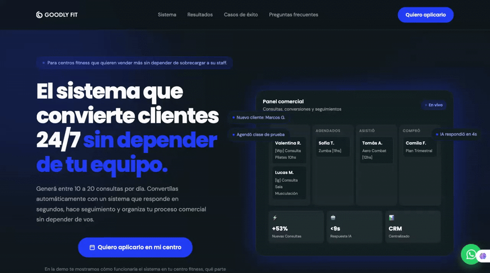

# Backup VSL Goodly Fit - 2026-05-26

Este archivo guarda el bloque VSL que se retiro temporalmente del hero para lanzar una version sin video.

## HTML original del VSL

```html
<div class="vsl-wrap reveal">
  <div class="vsl-frame" data-video-frame>
    <button class="vsl-cover" type="button" data-vsl-play aria-label="Reproducir video de Goodly Fit">
      
      <span class="vsl-cover-content">
        <span class="vsl-play" aria-hidden="true">
          <svg viewBox="0 0 24 24" fill="currentColor">
            <path d="M8 5v14l11-7z"></path>
          </svg>
        </span>
        <span class="vsl-label">Ver video</span>
      </span>
    </button>
    <a class="vsl-fallback" href="https://www.loom.com/share/59b82f786f6445b88f699f5e292e5dec" target="_blank" rel="noreferrer">
      <span class="vsl-play" aria-hidden="true">
        <svg viewBox="0 0 24 24" fill="currentColor">
          <path d="M8 5v14l11-7z"></path>
        </svg>
      </span>
      <strong>Ver video</strong>
    </a>
  </div>
</div>
```

## JS original del VSL

```js
const loomEmbedUrl = "https://www.loom.com/embed/59b82f786f6445b88f699f5e292e5dec?autoplay=1&hide_owner=true&hide_share=true&hide_title=true&hideEmbedTopBar=true&hide_speed=true&hide_watch_on_loom=true&raw_embed_video=true&minimal_player=true&disable_click_interactions=true";
const vslFrame = document.querySelector("[data-video-frame]");
const vslPlay = document.querySelector("[data-vsl-play]");

if (vslFrame && vslPlay) {
  vslPlay.addEventListener("click", () => {
    const tracking = getTrackingData();
    const eventId = makeEventId("gf_vsl_play");
    pushDataLayer("goodly_vsl_play", {
      event_id: eventId,
      tracking
    });
    trackMetaCustom("GoodlyVSLPlay", {
      content_name: "Goodly Fit VSL",
      utm_source: tracking.utmSource,
      utm_medium: tracking.utmMedium,
      utm_campaign: tracking.utmCampaign
    }, eventId);

    const iframe = document.createElement("iframe");
    iframe.src = loomEmbedUrl;
    iframe.title = "Goodly Fit VSL";
    iframe.allow = "autoplay; fullscreen; picture-in-picture";
    iframe.allowFullscreen = true;
    vslPlay.remove();
    vslFrame.classList.add("is-playing");
    vslFrame.appendChild(iframe);
  });
}
```

## Nota de restauracion

El CSS del VSL quedo en `index.html` para poder restaurarlo rapido. Para volver a activar el video, reinsertar el bloque HTML original dentro de `.hero-inner`, entre el headline y `.hero-cta`.
